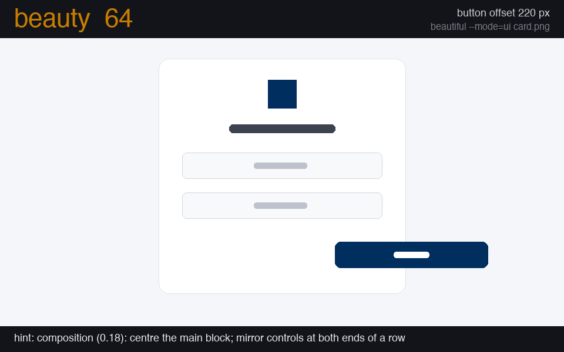
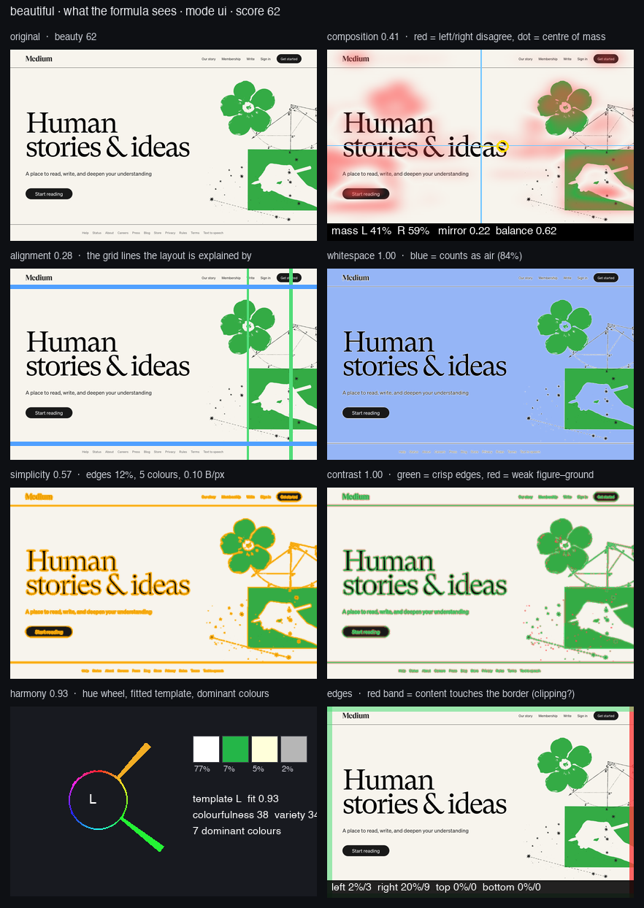
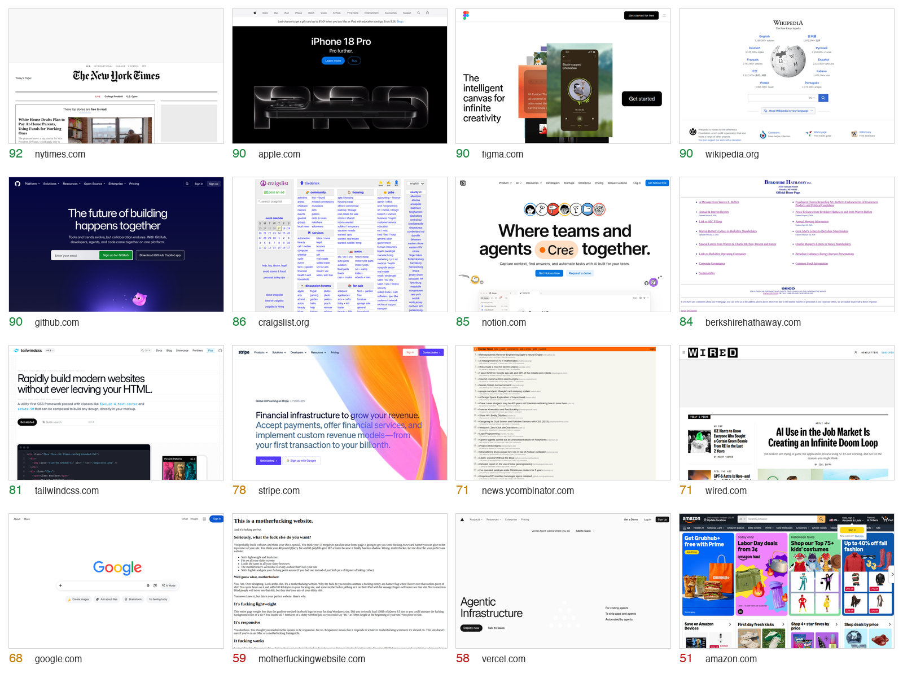
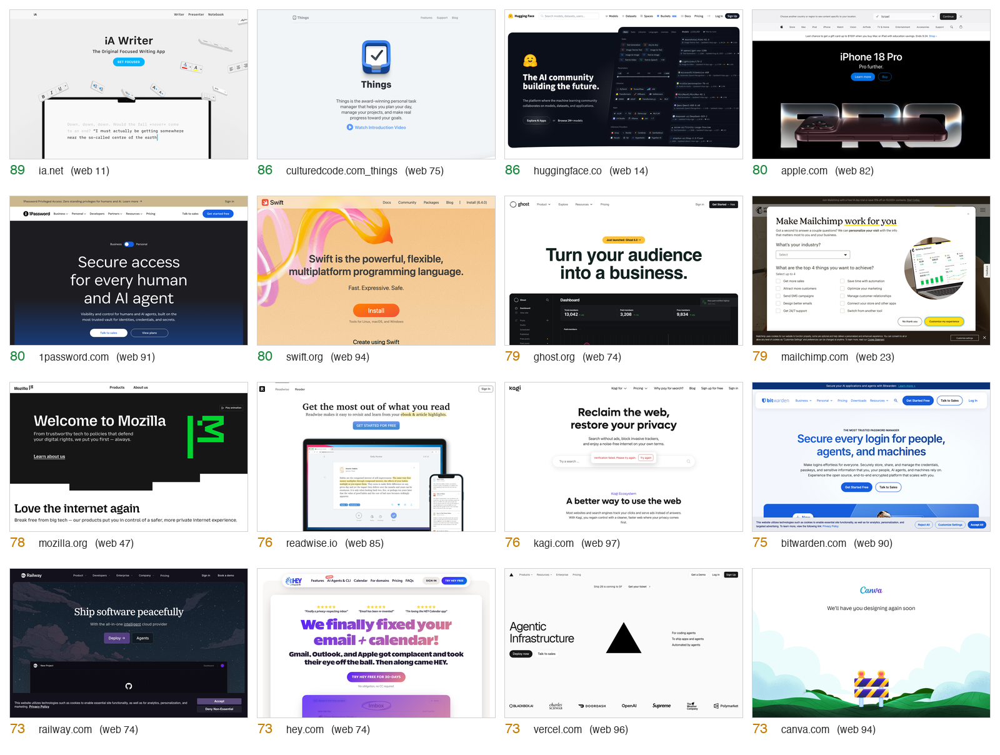
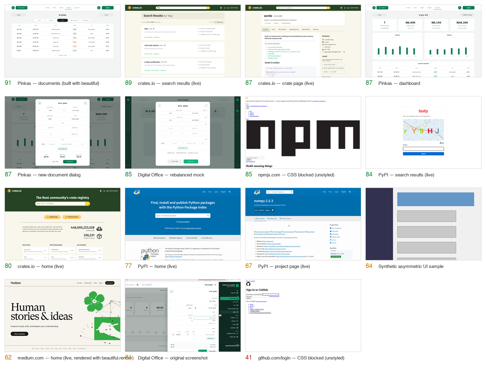

<h1 align="center">beautiful</h1>

<p align="center"><strong>A mathematical beauty score, 1–100, for any screenshot, logo, artwork — or the HTML behind it.</strong><br>
A beauty lint: explicit formulas from 90 years of aesthetics research, measured against human ratings, every number with its reasons, every page scored at desktop, tablet and mobile.</p>

<p align="center">
  <a href="https://solomonboltin.github.io/beautiful/"></a>
  <a href="https://github.com/solomonBoltin/beautiful/actions/workflows/ci.yml"></a>
  <a href="https://pypi.org/project/beautiful-score/"></a>
  <a href="LICENSE"></a>
  
  
  <a href="research/CALIBRATION.md"></a>
</p>

<p align="center"></p>

```python
from beautiful import beauty

r = beauty("screenshot.png", mode="ui")
r["score"]    # 76
r["factors"]  # {'composition': 1.0, 'alignment': 1.0, 'contrast': 0.18, 'harmony': 1.0, 'hierarchy': 0.01, ...}
r["hints"]    # ['contour (0.05): contours crowd each other more than on acclaimed pages', ...]
r["classic"]  # the literature-weighted formula's score and factors for the same image
```

**Beauty has structure.** Symmetry and balance, alignment to a grid, the right amount of white
space, a harmonic palette, crisp figure–ground contrast, intermediate complexity. Ninety years of
experimental aesthetics and HCI research measured each of these and found the ranges people
prefer. `beautiful` turns those findings into one formula: every term is a pixel measurement mapped
through a documented target curve, weighted, and summed. You can read every line of it, argue with
it, and improve it.

**And it is measured, not asserted.** The pure literature formula (`classic`) was put on a
bench: 100 of the most acclaimed home pages on the web, 100 random pages, a deliberately broken
twin of every acclaimed page, and 398 crowd-rated screenshots. It could not tell acclaimed
design from a random page (AUC 0.59) and preferred the broken twin a third of the time. So the
`ui` formula you get by default is the same explicit shape **fitted to that evidence**: every
curve centred on what acclaimed pages measure, weights chosen so that acclaimed beats ordinary,
an original beats its broken twin, and the orderings a designer would insist on hold —
cross-validated AUC 0.72, original over twin 74 %, 18 of 21 curated orderings. Four modes ship:
`ui` (fitted), `classic` (literature weights, also inside every `ui` report), `art` / `logo`
(explicit formulas), and `web` (calibrated on the crowd ratings). [The fit](research/FIT.md),
[the benchmark](research/BENCHMARK.md) and [the calibration](research/CALIBRATION.md) are the
most useful things in this repository.

## Install

```bash
pip install beautiful-score
```

Python 3.9+, pulls in `numpy`, `pillow`, `scipy` and nothing else. Or **[try it in your browser](https://solomonboltin.github.io/beautiful/)** — the same package running on Pyodide, your image never leaves the tab.

## 30 seconds

```bash
beautiful screenshot.png                     # score, every factor, and the hints
beautiful --mode=art a.jpg b.jpg c.png       # several images, scores only
beautiful --json screenshot.png              # the full report as JSON
beautiful --min 70 screenshot.png            # exit 1 below 70 — a CI gate
```

```
 76  screenshot.png
      composition   1.00
      local         0.67
      alignment     1.00
      contrast      0.18
      harmony       1.00
      edge_density  0.91
      jpeg_bpp      0.82
      colours       0.93
      whitespace    0.96
      colorfulness  0.97
      congestion    0.79
      contour       0.05
      orientation   0.49
      anisotropy    0.29
      hierarchy     0.01
      margin        0.99
  ->  contour (0.05): contours crowd each other more than on acclaimed pages
  ->  hierarchy (0.01): little structure at block scale: give the page a hero, sections or a clear heading scale
```

Modes: **`ui`** (screens, pages, apps — the formula fitted to acclaimed design), **`classic`**
(the same measurements with the literature's weights, unfitted), **`art`** (paintings, photos,
posters), **`logo`** (marks, icons), and **`web`**, the model calibrated on human ratings of
websites (its score is a percentile: web 70 = above 70 % of the 398 rated sites). Input can be a
path, a `PIL.Image`, or a numpy array. Every factor is a goodness in 0–1 (1 = in the range
acclaimed pages occupy); the hints name the terms losing the most points.

## Beauty lint

Lint the **code**, not a screenshot you took by hand. HTML strings, files and URLs are rendered
with headless Chromium at the three viewports a designer checks and scored one by one:

```bash
pip install "beautiful-score[render]" && playwright install chromium     # once; no Node needed

beautiful index.html                                # desktop 1280×800, tablet 768×1024, mobile 375×812
beautiful http://localhost:3000/pricing --viewports mobile
beautiful "http://localhost:6006/iframe.html?id=button--primary"        # a Storybook story = a component
beautiful src/pages/ --save-renders renders/        # every .html in a tree, keeping the PNGs
```

```
 92  docs/index.html@desktop
 87  docs/index.html@tablet
 92  docs/index.html@mobile
  tablet  composition 0.71  alignment 0.62  contrast 1.00  harmony 1.00  hierarchy 0.88  …
           ->  alignment (0.62): snap element edges to a shared column/row grid
```

The render is frozen — animations and transitions off, fonts awaited, network idle, fixed clock,
device-pixel-ratio 1 — so the same HTML + CSS + fonts give the same pixels and **the same score a
screenshot at that viewport would get**. Chromium is the reference; a static no-browser backend
(`pip install "beautiful-score[html]"`, WeasyPrint) exists for plain HTML/CSS and e-mail
templates, and its score is close, not identical, because it lays out with its own engine and
fonts. React/Vue/Svelte components are scored through whatever renders them: a Storybook or
Ladle story URL, or the dev server. (This demo page lints itself in CI at all three viewports,
and was redesigned with the tool from 67 / 61 / 49 to 92 / 84 / 78.)

Then the same lint on any image:

```bash
beautiful shots/                                   # every image in a folder (recursive), worst obvious at a glance
beautiful --min 70 shots/                          # exit 1 below 70
beautiful --save-baseline .beautiful.json shots/   # remember today's scores
beautiful --baseline .beautiful.json shots/        # exit 1 on any regression > 3 points
beautiful --format github shots/                   # ::warning annotations on the image files in a workflow
beautiful --format sarif shots/ > beauty.sarif     # GitHub code scanning (upload-sarif)
```

As a **pre-commit** hook:

```yaml
repos:
  - repo: https://github.com/solomonBoltin/beautiful
    rev: v0.4.0
    hooks:
      - id: beautiful
        args: ["--min", "60"]
        files: ^design/screens/.*\.png$
```

Exit codes: 0 fine · 1 below `--min` or a regression · 2 an input could not be read.

### See what it sees

```bash
beautiful --explain out/ shot.png        # writes out/shot.explain.png
```

<p align="center"></p>

One sheet per image, every factor drawn over it: the **mirror-disagreement map** (red where the
left half does not match the right) with the **centre of mass** and the left/right mass split;
the **grid lines** the alignment term is explained by; the **whitespace mask**; the **edge map**
behind simplicity; edges coloured by **contrast**; the **hue wheel** with the fitted harmony
template and the dominant colours; and the four **edge bands**, red where content touches the
border. The same sheet is one click away in the browser demo ("what does it see?") and one
argument away in the MCP tools (`explain_dir`). When you disagree with a number, this is where
the disagreement becomes a factor proposal.

### Defects are not taste

A page whose select box runs off the right edge of a phone is not "less beautiful", it is
broken, and the score must not average that away. So defects are reported separately from the
formula and cost points on top of it:

- **Overflow** (certain): when `beautiful` renders a page it asks the DOM for the scroll width
  and lists the elements that stick out of the viewport. Any horizontal overflow is a −10
  penalty and a hint naming the elements.
- **Clipping?** (suspected): on a plain screenshot, content touching a side edge in many
  separate places over a noticeable share of the height is what cut-off text looks like; the
  report says so and tells you to render the page to know for certain. A full-bleed image also
  touches the edge, so pixels alone never penalise.

`report["penalties"]` carries them; `--format github` and SARIF show them as errors.

### Rules the DOM can answer

When a page is rendered, a rule pass runs inside it — the part of a beauty lint that is not
taste, with the thresholds the guidelines agree on and the source on every finding. 44 rules:

<!-- table:rules -->
| rule | level | what | source |
|---|---|---|---|
| `text-contrast` | error | text under 4.5:1 (3:1 large) is unreadable for low-vision and in glare | WCAG 2.2 SC 1.4.3 |
| `font-size` | warning | text under 12 px needs zoom | Lighthouse legible font sizes; Google Mobile-Friendly |
| `font-size-mobile` | warning | body text under 16 px on a phone forces zoom and iOS zooms inputs | Apple HIG 17 pt; GOV.UK 16 px; Material 16 sp |
| `touch-target` | error | targets under 24 × 24 px are missed | WCAG 2.2 SC 2.5.8 |
| `touch-target-mobile` | warning | thumb targets need ~9 mm | Apple HIG 44 pt; Material 48 dp |
| `target-spacing` | warning | targets closer than 8 px are mis-tapped | Material 8 dp; Lighthouse tap-targets; WCAG 2.5.8 clearance |
| `line-length` | warning | screen studies support 45–95 characters per line | Dyson & Haselgrove 2001; Shaikh & Chaparro 2005; Bringhurst; GOV.UK |
| `line-height` | warning | body text under 1.2 line-height is cramped | WCAG 1.4.12; Butterick |
| `text-clipped` | error | text cut off by its box loses words | Xcode textClipped; ATF; UIS-Hunter |
| `text-overlap` | error | two text blocks drawn over each other are unreadable | OwlEye / Nighthawk display-issue classes |
| `image-distortion` | error | a stretched image reads as broken | Lighthouse image-aspect-ratio |
| `image-broken` | error | a broken placeholder is the most visible defect on a page | OwlEye missing-image class; Impeccable broken-image |
| `img-alt` | warning | images without alt are invisible to screen readers (55 % of pages fail) | WCAG 2.2 SC 1.1.1 |
| `viewport-meta` | error | without a viewport meta the page lays out at 980 px on phones and is zoomed out | Lighthouse viewport; MDN |
| `heading-order` | warning | skipped levels and a missing h1 break the outline assistive tech navigates by | WCAG 1.3.1; axe heading-order |
| `type-noise` | warning | more than 2–3 families or 8 sizes means no type system | Refactoring UI; Material type scale; Ant (3–5 sizes) |
| `empty-control` | error | a link or button with no accessible name cannot be used by assistive tech | WAVE link_empty / button_empty; WebAIM Million (45 % / 30 % of pages) |
| `generic-link` | warning | "click here" / "read more" say nothing out of context | WAVE link_suspicious; jsx-a11y anchor-ambiguous-text; Lighthouse link-text |
| `redundant-link` | warning | adjacent links to the same URL are read twice | WAVE link_redundant |
| `justified-text` | warning | justified text on the web produces rivers of white space | WCAG 1.4.8; WAVE text_justified |
| `underlined-text` | warning | underlined non-link text looks like a link | WAVE underline |
| `all-caps-body` | warning | long all-caps runs lose word shapes and read slowly | Butterick (caps only under one line); HansCo |
| `centered-body` | warning | centred paragraphs longer than 2–3 lines lose the reading axis | Refactoring UI; HansCo |
| `contrast-polarity` | warning | light-on-dark body text under 16 px is read less accurately | Piepenbrock, Mayr, Mund & Buchner 2013/2014 (N = 169) |
| `near-duplicate-colours` | warning | several colours within a just-noticeable difference of each other mean tokens were not used | Mahy 1994 (ΔE ≈ 2.3 JND); Refactoring UI; the "inconsistent greys" tell |
| `too-many-hues` | warning | more than seven distinct saturated hues on one page have no hierarchy | Healey 1996 (~7 hues pre-attentively); Ant / Refactoring UI palette limits |
| `pure-black-white` | note | #000 on #fff is harsh | Supercharge; Hobday rule 1; Hallmark gate 7 |
| `edge-margin` | warning | text touching the viewport edge looks cramped and may be cut by device bezels | Apple 16/20 pt; Material 16/24 dp screen-edge margins |
| `false-floor` | warning | when the first screenful ends on a clean edge with nothing peeking below, users think the page is over | NN/g Illusion of Completeness; CXL false bottom |
| `hidden-nav-desktop` | warning | a hamburger at desktop widths halves navigation use | Pernice & Budiu 2016 (N = 179): −20 % discoverability, +39 % time |
| `multiple-primaries` | warning | more than one primary button per view means nothing is primary | Balsamiq; Dannaway; KlientBoost; Von Restorff |
| `consent-asymmetry` | warning | a filled Accept next to a plain or link-styled Reject steers the choice | deceptive.design; EDPB cookie-banner taskforce; FTC; DSA Art. 25 |
| `prechecked-optin` | warning | a pre-ticked marketing box is consent nobody gave | deceptive.design preselection; DSA Art. 25 |
| `urgency-text` | note | countdowns, "only N left" and "N people viewing" are the most-cited deceptive patterns | deceptive.design fake urgency / scarcity / social proof; FTC |
| `confirmshaming` | note | a decline option phrased as self-insult manipulates | deceptive.design; Mathur et al. |
| `placeholder-residue` | error | lorem ipsum, "undefined", "null", "NaN" or "[object Object]" on a page means it is unfinished or broken | Mobile-UI-Repair null-value class; AI-slop lorem-ipsum tell |
| `focus-removed` | warning | outline: none without a replacement leaves keyboard users lost | WCAG 2.4.7; stylelint-a11y no-outline-none; Vercel WIG |
| `motion` | warning | autoplaying media and looping animation without a reduced-motion alternative trigger vestibular symptoms (35 % of adults over 40) | WCAG 2.3.3 / C39; axe no-autoplay-audio; Vercel WIG |
| `distracting-element` | error | blink and marquee are obsolete and cannot be paused | axe blink / marquee |
| `spacing-scale` | warning | gaps off a 4/8 px scale and many distinct gap values read as arbitrary | 8-pt grid (10+ design systems); RL-paper D1 spacing consistency |
| `ai-look` | note | indigo→cyan gradients, Inter as display, three identical icon cards, glass panels and nested cards are the tells readers use to spot generated pages | 8 sources 2025–2026 (925studios, mania.design, dev.to, Hallmark, Impeccable, taste-skill, ux-skill, Anthropic cookbook) |
| `thumb-reach` | note | a primary control in the top-far corner of a phone is out of one-handed reach | Bergstrom-Lehtovirta & Oulasvirta 2014; Hoober 2013 (49 % one-thumb) |
| `icon-off-centre` | warning | icon not centred in a text-less control (offset > 2.5 px) | Material icon buttons; Apple HIG |
| `dead-toggle` | error | button with aria-expanded / aria-controls that reveals nothing when clicked | WAI-ARIA APG disclosure; WCAG 4.1.2 |
<!-- /table:rules -->

Errors cost 3 points each (capped at 12); warnings and notes are free — a note is a tell, never
a penalty. Every finding carries `source`, `why` and `fix` plus the offending elements, in the
record format the agent-era linters use; the CLI, SARIF and the PR comment show them. The
fixtures in [`demo/lint/`](demo/lint/) are CI's proof that every planted defect is found and the
clean page is left alone. The [design-lint survey](research/DESIGN-LINTS.md) is where each rule
came from and what is still open.

## Famous sites, scored

Twenty well-known home pages captured at 1280×800 on 2026-09-19 and scored with `--mode=ui`.
Four captures came back blank or blocked and were dropped. Full table with every factor:
[`demo/results_famous.md`](demo/results_famous.md); reproduce with `python demo/famous.py`.



<!-- table:famous -->
| `ui` | `web` | site | what the `ui` formula sees |
|---:|---:|---|---|
| **85** | 83 | apple.com | one centred object, symmetric, calm palette, lots of air |
| **81** | 94 | notion.com | centred hero; balance carries it |
| **80** | 69 | github.com | left-weighted hero, low grid quality — but the masses balance |
| **77** | 60 | craigslist.org | balanced and airy; the densest edge map in the set |
| **72** | 30 | google.com | perfectly simple; the logo/search box sit high, so the mass is off-centre |
| **65** | 1 | news.ycombinator.com | the best **alignment** in the set (one column grid), but no composition to speak of |
| **40** | 88 | tailwindcss.com | strong left anchoring, nothing on the right to counterweight it |
| **40** | 45 | amazon.com | maximum edge density, 10 % background, 0.07 colour restraint |
| **32** | 76 | vercel.com | a near-empty viewport with one text block bottom-left |
| **28** | 76 | stripe.com | the diagonal gradient piles the mass on the right and wipes out symmetry |
<!-- /table:famous -->

The `ui` column is not a ranking of good websites. It is a ranking of *form in a single viewport*:
Apple's splash wins because the formula measures composition, not conversion; Craigslist beats
Stripe because Craigslist is balanced and Stripe's hero piles its mass on one side. The `web` column is what a
model fitted to human ratings says (Notion 94, Figma 91, Tailwindcss 88, Hacker News 1): raters
prefer rich, image-led, varied pages, and punish text-only ones. The two columns disagreeing is
the point — one is a readable rule, the other is the crowd, and the gap between them is where the
missing factors are (see below).

## Hall of fame — what a high score looks like on the real web

The famous-sites table above used a third-party screenshot service. This one uses the tool's own
renderer: 72 design-led home pages rendered with headless Chromium at 1280×800 on 2026-09-19,
frozen and scored. Bot walls and consent dialogs were dropped by hand (they are listed in
[`demo/results_hall_of_fame.md`](demo/results_hall_of_fame.md)); reproduce with `python demo/hall_of_fame.py`.



<!-- table:hall -->
| `ui` | `web` | site |
|---:|---:|---|
| **92** | 10 | ia.net |
| **89** | 81 | culturedcode.com/things |
| **85** | 93 | kagi.com |
| **84** | 16 | huggingface.co |
| **84** | 90 | duckduckgo.com |
| **83** | 87 | resend.com |
| **83** | 89 | notion.com |
| **82** | 72 | railway.com |
| **82** | 78 | readwise.io |
| **82** | 90 | swift.org |
| **81** | 84 | apple.com |
| **81** | 86 | clerk.com |
<!-- /table:hall -->

What the top of the table has in common: **one centred object, a calm palette, and air** — iA
Writer, Things, the Apple hero, Swift. The `ui` formula rewards exactly that, and it is blind to
what the `web` column (the crowd model) sees in Hugging Face or iA: it does not know that a
text-led page can be loved. Neither column is a verdict on the sites; both are a lens.

## Use it from your editor, agent or CI

**Claude Code plugin** — the skill and the MCP server in two commands:

```
/plugin marketplace add solomonBoltin/beautiful
/plugin install beautiful@beautiful
```

**MCP server** — four tools for Claude Code, Cursor, Windsurf and any MCP client, zero extra
dependencies: `beauty_score` (an image), `beauty_compare` (before/after), `beauty_lint` (a folder,
worst first), `beauty_render` (HTML string / file / URL at desktop, tablet and mobile — the agent
never takes a screenshot).

```bash
claude mcp add beautiful -- beautiful-mcp
```
```json
{ "mcpServers": { "beautiful": { "command": "beautiful-mcp" } } }
```

**Claude Code skill only** — copy [`skills/beautiful/`](skills/beautiful/) into `.claude/skills/`
(or `~/.claude/skills/`). It runs the render → score → read hints → edit loop after any UI change,
per viewport.

**GitHub Action** — score the screenshots your E2E suite already produces and get the table as a
PR comment:

```yaml
- uses: solomonBoltin/beautiful@v0.4.0
  with:
    images: "e2e/screens/*.png"
    min: 60          # optional: fail the job below this
    sarif: beauty.sarif   # optional: then upload it with github/codeql-action/upload-sarif
```

**Any agent** — one line in `AGENTS.md` / `.cursorrules`:

```md
After any change that renders something, screenshot it at 1280×800, run `beautiful --mode=ui shot.png`,
fix the top hint, re-score. Stop when the score stops moving. Report before/after.
```

The score is smooth enough to optimise (the GIF above is a real trace: 64 → 93 as a button walks
back to centre). [`demo/capture_and_score.py`](demo/capture_and_score.py) is a minimal driver.

---

## Demo: real UI screenshots



<!-- table:ui -->
| beauty | screen | composition | alignment | simplicity | whitespace | harmony | colour | contrast |
|---:|---|---:|---:|---:|---:|---:|---:|---:|
| **91** | Pinkas — documents (built with beautiful) | 0.83 | 0.63 | 0.85 | 0.86 | 1.00 | 0.93 | 1.00 |
| **89** | crates.io — search results (live) | 0.81 | 0.69 | 0.67 | 0.75 | 0.92 | 0.93 | 1.00 |
| **87** | crates.io — crate page (live) | 0.80 | 0.52 | 0.58 | 1.00 | 0.87 | 0.95 | 1.00 |
| **87** | Pinkas — dashboard | 0.89 | 0.26 | 0.76 | 1.00 | 1.00 | 0.97 | 1.00 |
| **87** | Pinkas — new-document dialog | 0.98 | 0.32 | 0.75 | 0.56 | 0.94 | 0.91 | 0.95 |
| **85** | Digital Office — rebalanced mock | 0.98 | 0.32 | 0.77 | 0.46 | 0.96 | 0.96 | 0.76 |
| **85** | npmjs.com — CSS blocked (unstyled) | 0.77 | 0.23 | 0.86 | 1.00 | 1.00 | 0.90 | 1.00 |
| **84** | PyPI — search results (live) | 0.94 | 0.40 | 0.75 | 1.00 | 0.79 | 0.99 | 0.37 |
| **80** | crates.io — home (live) | 0.74 | 0.26 | 0.61 | 1.00 | 0.92 | 1.00 | 1.00 |
| **77** | PyPI — home (live) | 0.78 | 0.22 | 0.67 | 1.00 | 0.98 | 0.23 | 1.00 |
| **67** | PyPI — project page (live) | 0.57 | 0.29 | 0.64 | 0.84 | 0.97 | 0.25 | 1.00 |
| **64** | Synthetic asymmetric UI sample | 0.10 | 0.61 | 0.86 | 0.66 | 0.94 | 1.00 | 1.00 |
| **62** | medium.com — home (live, rendered with beautiful.render) | 0.41 | 0.28 | 0.57 | 1.00 | 0.93 | 0.96 | 1.00 |
| **61** | Digital Office — original screenshot | 0.34 | 0.39 | 0.56 | 0.66 | 0.90 | 0.97 | 1.00 |
| **41** | github.com/login — CSS blocked (unstyled) | 0.11 | 0.31 | 1.00 | 0.09 | 1.00 | 0.88 | 1.00 |
<!-- /table:ui -->

What the numbers say, and where they are honest about their limits:

- The same product, re-composed (Digital Office 51 → 82), moves mostly on **composition** — the
  sidebar and docked modal put all the visual weight on one side.
- Production pages land at 68–85. Their weak factor is usually **alignment**: real pages have many
  container edges at many x-positions, and the metric rewards layouts that a few grid lines explain.
- The unstyled GitHub login (38) is caught by empty **whitespace** and left-anchored **composition**.
  The unstyled npm page (82) is *not* caught: a giant wordmark centred on white is, pixel-wise, a
  minimalist splash page. The function measures form, not intent.
- **contrast** saturates at 1.0 for most screens because modern UIs already meet it; it only bites
  on low-contrast designs (PyPI search results: 0.37).

### Art / logo modes

<!-- table:art -->
| beauty (art) | beauty (logo) | image | composition | harmony | simplicity | fractal D | Fourier α | thirds |
|---:|---:|---|---:|---:|---:|---:|---:|---:|
| **85** | 90 | radial mandala | 0.97 | 0.87 | 0.81 | 1.64 | -2.43 | 0.06 |
| **82** | 96 | shield logo | 0.92 | 0.99 | 0.25 | 1.23 | -2.78 | 0.41 |
| **69** | 96 | checkerboard | 0.97 | 1.00 | 0.82 | 1.81 | -2.16 | 0.00 |
| **67** | 95 | bilateral leaf | 0.92 | 0.97 | 0.21 | 1.11 | -2.69 | 0.55 |
| **48** | 18 | random coloured blobs | 0.06 | 0.57 | 0.35 | 1.40 | -2.73 | 0.26 |
| **47** | 54 | diagonal composition | 0.02 | 0.92 | 0.22 | 1.15 | -2.78 | 0.26 |
| **42** | 37 | abstract splashes | 0.06 | 0.92 | 0.30 | 1.32 | -2.72 | 0.15 |
| **5** | 17 | random noise | 0.05 | 0.38 | 0.00 | 2.00 | 0.01 | 0.00 |
<!-- /table:art -->