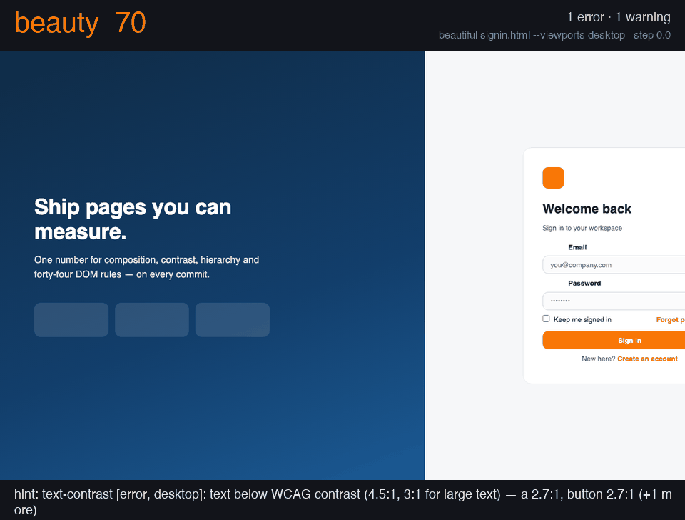
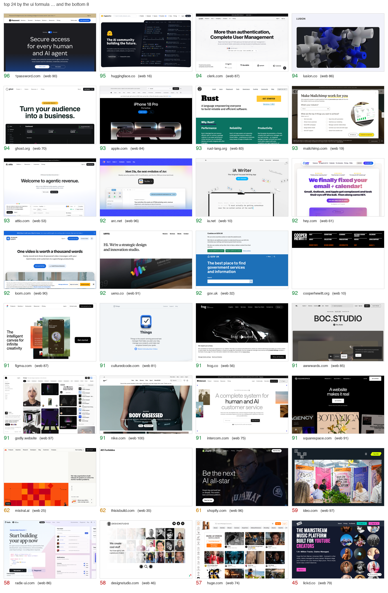
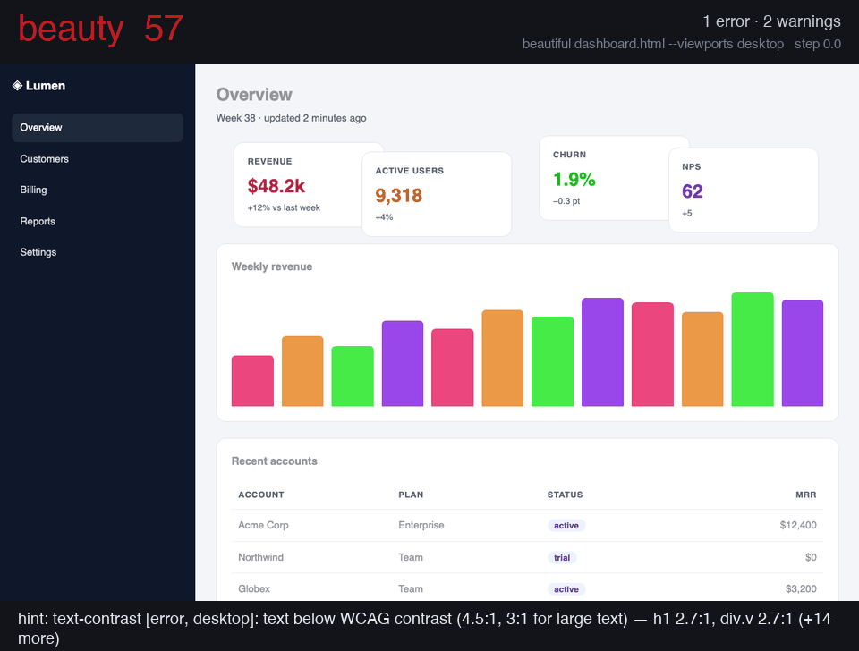
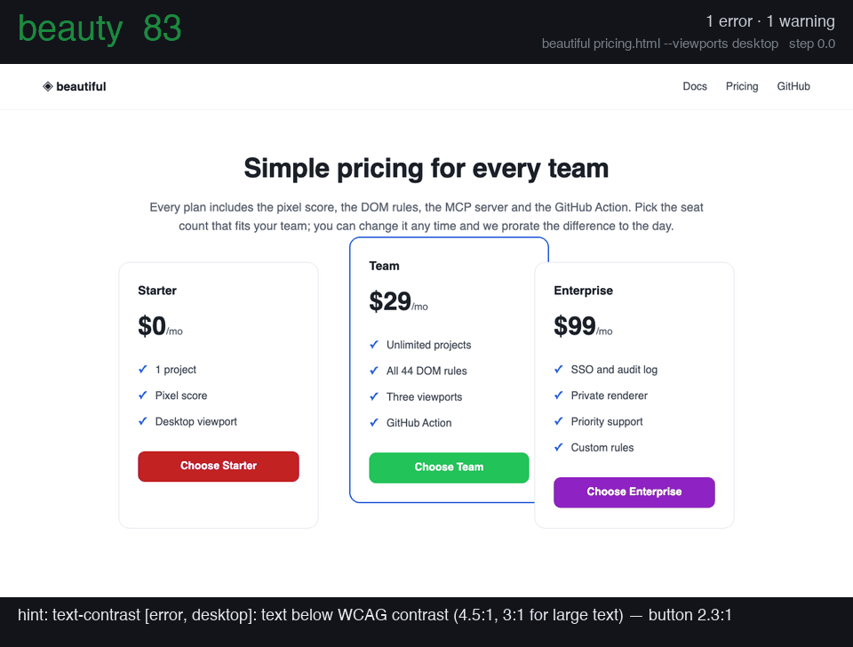
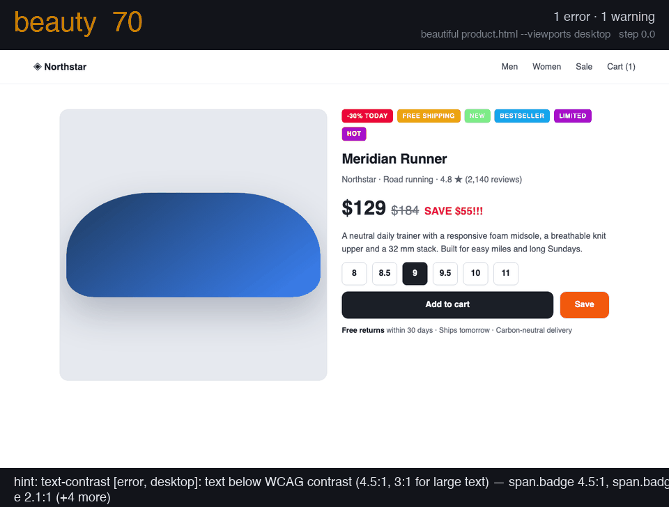
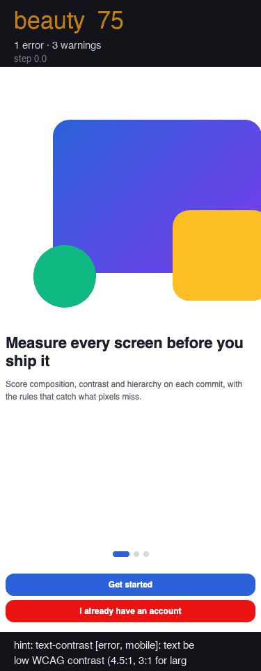
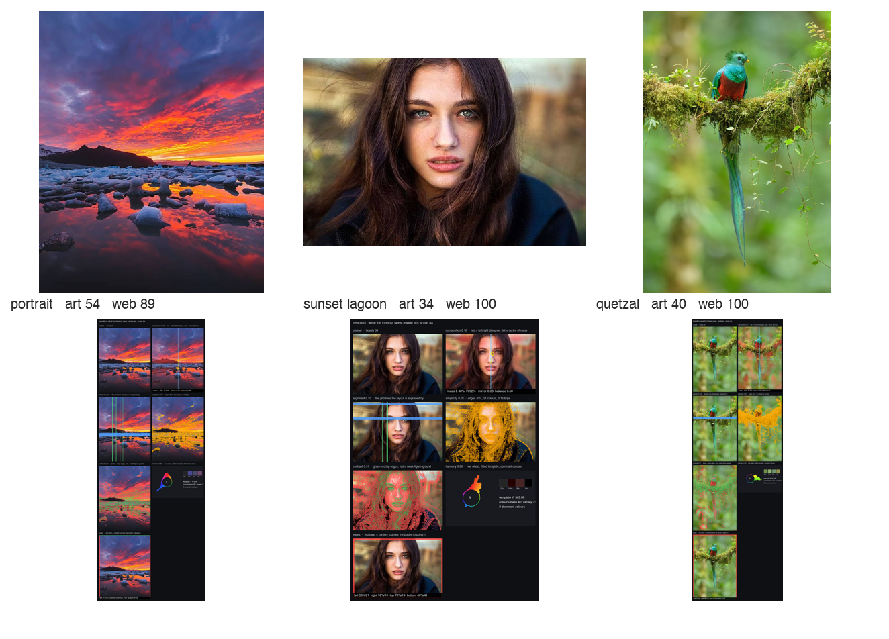
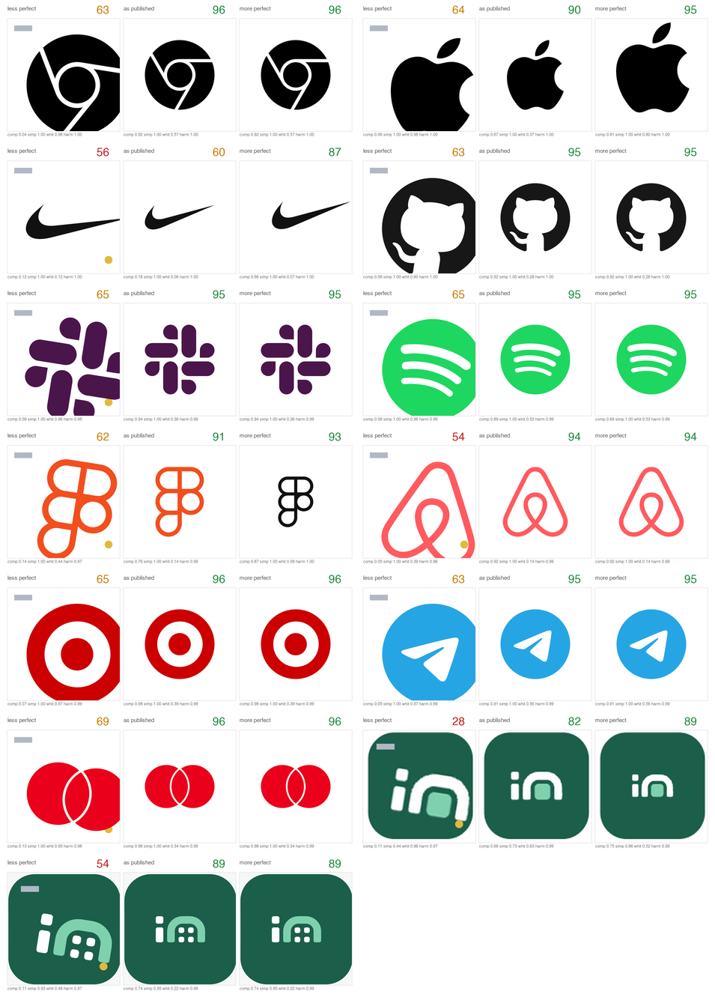

<h1 align="center">beautiful</h1>

<p align="center"><strong>A mathematical beauty score, 1–100, for any screenshot, logo, artwork — or the HTML behind it.</strong><br>
A beauty lint: explicit formulas from 90 years of aesthetics research, measured against human ratings, every number with its reasons, every page scored at desktop, tablet and mobile.</p>

<p align="center">
  <a href="https://solomonboltin.github.io/beautiful/"></a>
  <a href="https://github.com/solomonBoltin/beautiful/actions/workflows/ci.yml"></a>
  <a href="https://pypi.org/project/beautiful-score/"></a>
  <a href="LICENSE"></a>
  
  
  <a href="research/CALIBRATION.md"></a>
</p>

<p align="center"></p>

```python
from beautiful import beauty

r = beauty("screenshot.png", mode="ui")
r["score"]    # 76
r["factors"]  # {'composition': 1.0, 'alignment': 1.0, 'contrast': 0.18, 'harmony': 1.0, 'hierarchy': 0.01, ...}
r["hints"]    # ['contour (0.05): contours crowd each other more than on acclaimed pages', ...]
r["classic"]  # the literature-weighted formula's score and factors for the same image
```

**Beauty has structure.** Symmetry and balance, alignment to a grid, the right amount of white
space, a harmonic palette, crisp figure–ground contrast, intermediate complexity. Ninety years of
experimental aesthetics and HCI research measured each of these and found the ranges people
prefer. `beautiful` turns those findings into one formula: every term is a pixel measurement mapped
through a documented target curve, weighted, and summed. You can read every line of it, argue with
it, and improve it.

**And it is measured, not asserted.** The pure literature formula (`classic`) was put on a
bench: 100 of the most acclaimed home pages on the web, 100 random pages, a deliberately broken
twin of every acclaimed page, and 398 crowd-rated screenshots. It could not tell acclaimed
design from a random page (AUC 0.59) and preferred the broken twin a third of the time. So the
`ui` formula you get by default is the same explicit shape **fitted to that evidence**: every
curve centred on what acclaimed pages measure, weights chosen so that acclaimed beats ordinary,
an original beats its broken twin, and the orderings a designer would insist on hold —
cross-validated AUC 0.72, original over twin 74 %, 18 of 21 curated orderings. Four modes ship:
`ui` (fitted), `classic` (literature weights, also inside every `ui` report), `art` / `logo`
(explicit formulas), and `web` (calibrated on the crowd ratings). [The fit](research/FIT.md),
[the benchmark](research/BENCHMARK.md) and [the calibration](research/CALIBRATION.md) are the
most useful things in this repository.

## Install

```bash
pip install beautiful-score
```

Python 3.9+, pulls in `numpy`, `pillow`, `scipy` and nothing else. Or **[try it in your browser](https://solomonboltin.github.io/beautiful/)** — the same package running on Pyodide, your image never leaves the tab.

## 30 seconds

```bash
beautiful screenshot.png                     # score, every factor, and the hints
beautiful --mode=art a.jpg b.jpg c.png       # several images, scores only
beautiful --json screenshot.png              # the full report as JSON
beautiful --min 70 screenshot.png            # exit 1 below 70 — a CI gate
```

```
 76  screenshot.png
      composition   1.00
      local         0.67
      alignment     1.00
      contrast      0.18
      harmony       1.00
      edge_density  0.91
      jpeg_bpp      0.82
      colours       0.93
      whitespace    0.96
      colorfulness  0.97
      congestion    0.79
      contour       0.05
      orientation   0.49
      anisotropy    0.29
      hierarchy     0.01
      margin        0.99
  ->  contour (0.05): contours crowd each other more than on acclaimed pages
  ->  hierarchy (0.01): little structure at block scale: give the page a hero, sections or a clear heading scale
```

Modes: **`ui`** (screens, pages, apps — the formula fitted to acclaimed design), **`classic`**
(the same measurements with the literature's weights, unfitted), **`art`** (paintings, photos,
posters), **`logo`** (marks, icons), and **`web`**, the model calibrated on human ratings of
websites (its score is a percentile: web 70 = above 70 % of the 398 rated sites). Input can be a
path, a `PIL.Image`, or a numpy array. Every factor is a goodness in 0–1 (1 = in the range
acclaimed pages occupy); the hints name the terms losing the most points.

## Beauty lint

Lint the **code**, not a screenshot you took by hand. HTML strings, files and URLs are rendered
with headless Chromium at the three viewports a designer checks and scored one by one:

```bash
pip install "beautiful-score[render]" && playwright install chromium     # once; no Node needed

beautiful index.html                                # desktop 1280×800, tablet 768×1024, mobile 375×812
beautiful http://localhost:3000/pricing --viewports mobile
beautiful "http://localhost:6006/iframe.html?id=button--primary"        # a Storybook story = a component
beautiful src/pages/ --save-renders renders/        # every .html in a tree, keeping the PNGs
```

```
 92  docs/index.html@desktop
 87  docs/index.html@tablet
 92  docs/index.html@mobile
  tablet  composition 0.71  alignment 0.62  contrast 1.00  harmony 1.00  hierarchy 0.88  …
           ->  alignment (0.62): snap element edges to a shared column/row grid
```

The render is frozen — animations and transitions off, fonts awaited, network idle, fixed clock,
device-pixel-ratio 1 — so the same HTML + CSS + fonts give the same pixels and **the same score a
screenshot at that viewport would get**. Chromium is the reference; a static no-browser backend
(`pip install "beautiful-score[html]"`, WeasyPrint) exists for plain HTML/CSS and e-mail
templates, and its score is close, not identical, because it lays out with its own engine and
fonts. React/Vue/Svelte components are scored through whatever renders them: a Storybook or
Ladle story URL, or the dev server. (This demo page lints itself in CI at all three viewports,
and was redesigned with the tool from 67 / 61 / 49 to 92 / 84 / 78.)

Then the same lint on any image:

```bash
beautiful shots/                                   # every image in a folder (recursive), worst obvious at a glance
beautiful --min 70 shots/                          # exit 1 below 70
beautiful --save-baseline .beautiful.json shots/   # remember today's scores
beautiful --baseline .beautiful.json shots/        # exit 1 on any regression > 3 points
beautiful --format github shots/                   # ::warning annotations on the image files in a workflow
beautiful --format sarif shots/ > beauty.sarif     # GitHub code scanning (upload-sarif)
```

As a **pre-commit** hook:

```yaml
repos:
  - repo: https://github.com/solomonBoltin/beautiful
    rev: v0.4.0
    hooks:
      - id: beautiful
        args: ["--min", "60"]
        files: ^design/screens/.*\.png$
```

Exit codes: 0 fine · 1 below `--min` or a regression · 2 an input could not be read.

### See what it sees

```bash
beautiful --explain out/ shot.png        # writes out/shot.explain.png
```

<p align="center"></p>

One sheet per image, every factor drawn over it: the **mirror-disagreement map** (red where the
left half does not match the right) with the **centre of mass** and the left/right mass split;
the **grid lines** the alignment term is explained by; the **whitespace mask**; the **edge map**
behind simplicity; edges coloured by **contrast**; the **hue wheel** with the fitted harmony
template and the dominant colours; and the four **edge bands**, red where content touches the
border. The same sheet is one click away in the browser demo ("what does it see?") and one
argument away in the MCP tools (`explain_dir`). When you disagree with a number, this is where
the disagreement becomes a factor proposal.

### Defects are not taste

A page whose select box runs off the right edge of a phone is not "less beautiful", it is
broken, and the score must not average that away. So defects are reported separately from the
formula and cost points on top of it:

- **Overflow** (certain): when `beautiful` renders a page it asks the DOM for the scroll width
  and lists the elements that stick out of the viewport. Any horizontal overflow is a −10
  penalty and a hint naming the elements.
- **Clipping?** (suspected): on a plain screenshot, content touching a side edge in many
  separate places over a noticeable share of the height is what cut-off text looks like; the
  report says so and tells you to render the page to know for certain. A full-bleed image also
  touches the edge, so pixels alone never penalise.

`report["penalties"]` carries them; `--format github` and SARIF show them as errors.

### Components, each on its own

A page score hides a broken part inside a good whole. On rendered pages every landmark, section
and control is discovered in the DOM, cropped from one full-page screenshot and scored on its own
(the `classic` scale; controls are judged on both-axis symmetry, so an off-centre icon in a menu
button shows). `--components` lists them with stable keys; `--save-baseline` stores them, and
`--baseline` exits 1 when any one of them gets less beautiful, not only the page.

```bash
beautiful https://example.com --components          # header 88, nav 91, button#menu 74 …
beautiful https://example.com --save-baseline b.json
beautiful https://example.com --baseline b.json       # fails on a score drop, a new error, or a worse component
```

### Rules the DOM can answer

When a page is rendered, a rule pass runs inside it — the part of a beauty lint that is not
taste, with the thresholds the guidelines agree on and the source on every finding. 44 rules:

<!-- table:rules -->
| rule | level | what | source |
|---|---|---|---|
| `text-contrast` | error | text under 4.5:1 (3:1 large) is unreadable for low-vision and in glare | WCAG 2.2 SC 1.4.3 |
| `font-size` | warning | text under 12 px needs zoom | Lighthouse legible font sizes; Google Mobile-Friendly |
| `font-size-mobile` | warning | body text under 16 px on a phone forces zoom and iOS zooms inputs | Apple HIG 17 pt; GOV.UK 16 px; Material 16 sp |
| `touch-target` | error | targets under 24 × 24 px are missed | WCAG 2.2 SC 2.5.8 |
| `touch-target-mobile` | warning | thumb targets need ~9 mm | Apple HIG 44 pt; Material 48 dp |
| `target-spacing` | warning | targets closer than 8 px are mis-tapped | Material 8 dp; Lighthouse tap-targets; WCAG 2.5.8 clearance |
| `line-length` | warning | screen studies support 45–95 characters per line | Dyson & Haselgrove 2001; Shaikh & Chaparro 2005; Bringhurst; GOV.UK |
| `line-height` | warning | body text under 1.2 line-height is cramped | WCAG 1.4.12; Butterick |
| `text-clipped` | error | text cut off by its box loses words | Xcode textClipped; ATF; UIS-Hunter |
| `text-overlap` | error | two text blocks drawn over each other are unreadable | OwlEye / Nighthawk display-issue classes |
| `image-distortion` | error | a stretched image reads as broken | Lighthouse image-aspect-ratio |
| `image-broken` | error | a broken placeholder is the most visible defect on a page | OwlEye missing-image class; Impeccable broken-image |
| `img-alt` | warning | images without alt are invisible to screen readers (55 % of pages fail) | WCAG 2.2 SC 1.1.1 |
| `viewport-meta` | error | without a viewport meta the page lays out at 980 px on phones and is zoomed out | Lighthouse viewport; MDN |
| `heading-order` | warning | skipped levels and a missing h1 break the outline assistive tech navigates by | WCAG 1.3.1; axe heading-order |
| `type-noise` | warning | more than 2–3 families or 8 sizes means no type system | Refactoring UI; Material type scale; Ant (3–5 sizes) |
| `empty-control` | error | a link or button with no accessible name cannot be used by assistive tech | WAVE link_empty / button_empty; WebAIM Million (45 % / 30 % of pages) |
| `generic-link` | warning | "click here" / "read more" say nothing out of context | WAVE link_suspicious; jsx-a11y anchor-ambiguous-text; Lighthouse link-text |
| `redundant-link` | warning | adjacent links to the same URL are read twice | WAVE link_redundant |
| `justified-text` | warning | justified text on the web produces rivers of white space | WCAG 1.4.8; WAVE text_justified |
| `underlined-text` | warning | underlined non-link text looks like a link | WAVE underline |
| `all-caps-body` | warning | long all-caps runs lose word shapes and read slowly | Butterick (caps only under one line); HansCo |
| `centered-body` | warning | centred paragraphs longer than 2–3 lines lose the reading axis | Refactoring UI; HansCo |
| `contrast-polarity` | warning | light-on-dark body text under 16 px is read less accurately | Piepenbrock, Mayr, Mund & Buchner 2013/2014 (N = 169) |
| `near-duplicate-colours` | warning | several colours within a just-noticeable difference of each other mean tokens were not used | Mahy 1994 (ΔE ≈ 2.3 JND); Refactoring UI; the "inconsistent greys" tell |
| `too-many-hues` | warning | more than seven distinct saturated hues on one page have no hierarchy | Healey 1996 (~7 hues pre-attentively); Ant / Refactoring UI palette limits |
| `pure-black-white` | note | #000 on #fff is harsh | Supercharge; Hobday rule 1; Hallmark gate 7 |
| `edge-margin` | warning | text touching the viewport edge looks cramped and may be cut by device bezels | Apple 16/20 pt; Material 16/24 dp screen-edge margins |
| `false-floor` | warning | when the first screenful ends on a clean edge with nothing peeking below, users think the page is over | NN/g Illusion of Completeness; CXL false bottom |
| `hidden-nav-desktop` | warning | a hamburger at desktop widths halves navigation use | Pernice & Budiu 2016 (N = 179): −20 % discoverability, +39 % time |
| `multiple-primaries` | warning | more than one primary button per view means nothing is primary | Balsamiq; Dannaway; KlientBoost; Von Restorff |
| `consent-asymmetry` | warning | a filled Accept next to a plain or link-styled Reject steers the choice | deceptive.design; EDPB cookie-banner taskforce; FTC; DSA Art. 25 |
| `prechecked-optin` | warning | a pre-ticked marketing box is consent nobody gave | deceptive.design preselection; DSA Art. 25 |
| `urgency-text` | note | countdowns, "only N left" and "N people viewing" are the most-cited deceptive patterns | deceptive.design fake urgency / scarcity / social proof; FTC |
| `confirmshaming` | note | a decline option phrased as self-insult manipulates | deceptive.design; Mathur et al. |
| `placeholder-residue` | error | lorem ipsum, "undefined", "null", "NaN" or "[object Object]" on a page means it is unfinished or broken | Mobile-UI-Repair null-value class; AI-slop lorem-ipsum tell |
| `focus-removed` | warning | outline: none without a replacement leaves keyboard users lost | WCAG 2.4.7; stylelint-a11y no-outline-none; Vercel WIG |
| `motion` | warning | autoplaying media and looping animation without a reduced-motion alternative trigger vestibular symptoms (35 % of adults over 40) | WCAG 2.3.3 / C39; axe no-autoplay-audio; Vercel WIG |
| `distracting-element` | error | blink and marquee are obsolete and cannot be paused | axe blink / marquee |
| `spacing-scale` | warning | gaps off a 4/8 px scale and many distinct gap values read as arbitrary | 8-pt grid (10+ design systems); RL-paper D1 spacing consistency |
| `ai-look` | note | indigo→cyan gradients, Inter as display, three identical icon cards, glass panels and nested cards are the tells readers use to spot generated pages | 8 sources 2025–2026 (925studios, mania.design, dev.to, Hallmark, Impeccable, taste-skill, ux-skill, Anthropic cookbook) |
| `thumb-reach` | note | a primary control in the top-far corner of a phone is out of one-handed reach | Bergstrom-Lehtovirta & Oulasvirta 2014; Hoober 2013 (49 % one-thumb) |
| `icon-off-centre` | warning | icon not centred in a text-less control (offset > 2.5 px) | Material icon buttons; Apple HIG |
| `dead-toggle` | error | button with aria-expanded / aria-controls that reveals nothing when clicked | WAI-ARIA APG disclosure; WCAG 4.1.2 |
<!-- /table:rules -->

Errors cost 3 points each (capped at 12); warnings and notes are free — a note is a tell, never
a penalty. Every finding carries `source`, `why` and `fix` plus the offending elements, in the
record format the agent-era linters use; the CLI, SARIF and the PR comment show them. The
fixtures in [`demo/lint/`](demo/lint/) are CI's proof that every planted defect is found and the
clean page is left alone. The [design-lint survey](research/DESIGN-LINTS.md) is where each rule
came from and what is still open.

## Famous sites, scored

Twenty well-known home pages captured at 1280×800 on 2026-09-19 and scored with `--mode=ui`.
Four captures came back blank or blocked and were dropped. Full table with every factor:
[`demo/results_famous.md`](demo/results_famous.md); reproduce with `python demo/famous.py`.


<!-- table:famous -->
| `ui` | `web` | site | weakest term |
|---:|---:|---|---|
| **92** | 64 | nytimes.com | alignment (0.43) |
| **90** | 83 | apple.com | alignment (0.24) |
| **90** | 91 | figma.com | alignment (0.25) |
| **90** | 69 | wikipedia.org | local (0.47) |
| **90** | 69 | github.com | alignment (0.40) |
| **86** | 60 | craigslist.org | harmony (0.26) |
| **85** | 94 | notion.com | alignment (0.02) |
| **84** | 16 | berkshirehathaway.com | local (0.43) |
| **81** | 88 | tailwindcss.com | alignment (0.10) |
| **78** | 76 | stripe.com | colorfulness (0.54) |
<!-- /table:famous -->

The `ui` column is not a ranking of good websites. It is a ranking of *form in a single viewport*,
by a formula fitted to what acclaimed pages measure: Apple, Figma and GitHub sit at 90 because
they are composed, quiet at the edges and structured at block scale; Stripe loses on its
off-centre gradient hero, Amazon (51) on clutter. The formula's known blind spot is right there
in the table too: **Craigslist (86) and Berkshire Hathaway (84)** are well-set plain pages, and
pixels alone cannot tell a well-set plain page from a designed one — that is what the DOM rules
are for (the lint flags both for line length, type noise and missing hierarchy). The `web`
column is the crowd model (Notion 94, Figma 91, Berkshire 16): raters prefer rich, image-led
pages and punish text-only ones. The columns disagreeing is the point — one is a readable rule,
the other is the crowd, and the gap between them is where the missing factors are.

## Hall of fame — what a high score looks like on the real web

The famous-sites table above used a third-party screenshot service. This one uses the tool's own
renderer: 72 design-led home pages rendered with headless Chromium at 1280×800 on 2026-09-19,
frozen and scored. Bot walls and consent dialogs were dropped by hand (they are listed in
[`demo/results_hall_of_fame.md`](demo/results_hall_of_fame.md)); reproduce with `python demo/hall_of_fame.py`.


<!-- table:hall -->
| `ui` | `web` | site |
|---:|---:|---|
| **96** | 90 | 1password.com |
| **95** | 16 | huggingface.co |
| **95** | 49 | mozilla.org |
| **94** | 86 | clerk.com |
| **94** | 69 | ghost.org |
| **93** | 84 | apple.com |
| **93** | 19 | mailchimp.com |
| **93** | 83 | rust-lang.org |
| **93** | 72 | go.dev |
| **92** | 96 | arc.net |
| **92** | 61 | hey.com |
| **92** | 10 | ia.net |
<!-- /table:hall -->

What the top of the table has in common: **one composed hero, quiet margins, structure at block
scale, and a palette that fits a template** — 1Password, Hugging Face, Clerk, Ghost, the Apple
hero, Rust. This is the set the `ui` formula was fitted on (cross-validated, so every page was
scored by a fit that had not seen it); the full 100 with every factor are in
[`research/results_top100.md`](research/results_top100.md) and the section below.

## The 100 most acclaimed pages — and the bench the formula had to pass



100 home pages that designers point to (Awwwards and Siteinspire honourees, brand and type
showcases, the developer-tool pages everyone copies), rendered with the tool's own frozen
Chromium at 1280×800 on 2026-09-19 and scored. Median `ui` 84; 61 of the 100 score 80 or
more; the bottom five are pages whose hero is a full-bleed photograph or a near-empty dark
viewport, which the pixel measures read as clutter or as nothing. Reproduce with
`python research/top100.py` (the candidate list and the 44 dropped captures are in the file).

They are one third of a **bench** (`research/benchmark.py`, `research/degrade.py`,
`research/fit_ui.py`):

| set | what it is | what a score must do |
|---|---|---|
| 100 acclaimed | the pages above | outscore the ordinary set (AUC) |
| 100 ordinary | random Alexa-top-5000 pages, with human pairwise ranks | — |
| 100 degraded twins | each acclaimed page with one injected defect: a block shifted off its grid, content clipped at the viewport, an overlapping duplicate, a stretched region, a contrast wash, clutter, a lopsided crop, a colour cast | lose to its original |
| 398 crowd-rated | Reinecke & Gajos 2014 screenshots with mean appeal ratings | not correlate negatively |
| 21 curated orderings | the repo's own test pairs: rebalanced > original, composed screens > unstyled, designed pages > plain text | hold, by a margin |

| cross-validated | `classic` (literature weights) | `web` (crowd model) | **`ui` (fitted)** |
|---|---:|---:|---:|
| AUC acclaimed > ordinary | 0.59 | 0.61 | **0.72** |
| original beats its degraded twin | 63 % | 37 % | **74 %** |
| ρ vs crowd rating | −0.08 | +0.60 | **+0.14** |
| curated orderings respected | — | — | **18 / 21** |

The fitted formula is the same explicit shape as the literature one — a weighted sum of
documented curves over pixel measurements — with two differences you can read in
[`beautiful/ui_model.json`](beautiful/ui_model.json): each curve is centred on what the
acclaimed pages measure (their medians are the most useful numbers in
[`research/FIT.md`](research/FIT.md)), and the weights were chosen against the bench, under
priors that keep it a *UI* score (composition at least 15 % of the weight; the photographic
texture and amount-of-content terms capped, because without the caps the fit learned
"marketing page with a photo"). The three curated orderings it still misses all say the same
thing: a well-set plain page can outscore a designed one on pixels alone. The defects it catches
best are clutter and shifted blocks (100 %), a lopsided crop (83 %), clipping and overlap (77 %);
worst is a colour cast (50 %), because the palette terms are the weakest in the formula — a
factor proposal that fixes that has a bench to prove it on ([FACTORS.md](FACTORS.md)).

One number in [`research/BENCHMARK.md`](research/BENCHMARK.md) is deliberately left ugly: against the
ten *rendered lint fixtures* (the pages planted with 44 DOM defects), the pixel score alone reaches
only AUC 0.55 from the acclaimed side and 0.35 from the ordinary side. Pixels do not see a missing
alt text, a 9 px font or a pre-ticked checkbox. Render the page and the rules do — which is why the
lint's number is the pixel score *minus* the rule penalties, never the pixel score alone.

## Five scenarios, rendered and scored

Real HTML, not drawings: each scene in [`demo/scenes/scenes.py`](demo/scenes/scenes.py) is a page
parameterised from the state a rushed commit ships to the polished one. Every frame is rendered by
the tool's own frozen Chromium and scored by the lint (pixel formula plus the 44 DOM rules), so
the number and the hint on each frame are what `beautiful page.html` prints. Rebuild with
`python demo/make_scene_gifs.py`.

| scene | viewport | from → to | lint score (rule errors) |
|---|---|---|---:|
| [signin](demo/gifs/signin.gif) | desktop | Sign-in split screen: off-axis card, clashing accent, floating labels → one axis, one accent, 48 px targets | 70 (1 error) → **82** (0) |
| [dashboard](demo/gifs/dashboard.gif) | desktop | Analytics dashboard: cards off the grid, four accents, washed text → 8 px grid, one accent, crisp contrast | 57 (1 error) → **64** (0) |
| [pricing](demo/gifs/pricing.gif) | desktop | Pricing tiers: the highlighted tier lifted and shifted, three CTA colours, centred paragraph → equal cards, one primary | 83 (1 error) → **91** (0) |
| [product](demo/gifs/product.gif) | desktop | Product page: six badges, a stretched hero, three price sizes → one image, one price, one action | 70 (1 error) → **74** (0) |
| [onboarding](demo/gifs/onboarding.gif) | mobile | Phone onboarding: illustration bleeding off the edge, 12 px text, 32 px buttons → margins, 16 px body, 48 px targets | 75 (1 error) → **91** (0) |

<p align="center"></p>
<p align="center"></p>
<p align="center"></p>
<p align="center"></p>
<p align="center"></p>

What the frames teach: the WCAG contrast error is what moves first (an error costs points and
names its element); the pixel score then follows composition and hierarchy. The dashboard stays
in the 60s even when polished because a dense data page *is* contour-heavy — the score is a lens,
the rule list is the checklist.

### Photographs — where the `art` formula stops



| photo | `art` | `web` | what went wrong |
|---|---:|---:|---|
| portrait | 54 | 89 | composition 0.12: hair and a tilted head read as asymmetric mass, though the face is centred |
| sunset over a glacier lagoon | 34 | 100 | simplicity 0.02 and fractal 0.01: cloud texture is outside the bells the art formula was written with |
| resplendent quetzal | 40 | 100 | contrast 0.27, local 0.24: no term for subject isolation, the one thing this photo is about |

Three photographs most people would call beautiful, scored honestly. The `art` formula was
checked on eight synthetic images and never on photographs; the crowd-calibrated `web` model
gets them right for the wrong reasons (it likes rich, colourful images). Fixing this needs a photo
bench like the UI one — [issue #46](https://github.com/solomonBoltin/beautiful/issues/46) says
what it would take. Until then `art` is a formula for graphic composition, not a photo critic.

## Use it from your editor, agent or CI

**Claude Code plugin** — the skill and the MCP server in two commands:

```
/plugin marketplace add solomonBoltin/beautiful
/plugin install beautiful@beautiful
```

**MCP server** — four tools for Claude Code, Cursor, Windsurf and any MCP client, zero extra
dependencies: `beauty_score` (an image), `beauty_compare` (before/after), `beauty_lint` (a folder,
worst first), `beauty_render` (HTML string / file / URL at desktop, tablet and mobile — the agent
never takes a screenshot).

```bash
claude mcp add beautiful -- beautiful-mcp
```
```json
{ "mcpServers": { "beautiful": { "command": "beautiful-mcp" } } }
```

**Claude Code skill only** — copy [`skills/beautiful/`](skills/beautiful/) into `.claude/skills/`
(or `~/.claude/skills/`). It runs the render → score → read hints → edit loop after any UI change,
per viewport.

**GitHub Action** — score the screenshots your E2E suite already produces and get the table as a
PR comment:

```yaml
- uses: solomonBoltin/beautiful@v0.4.0
  with:
    images: "e2e/screens/*.png"
    min: 60          # optional: fail the job below this
    sarif: beauty.sarif   # optional: then upload it with github/codeql-action/upload-sarif
```

**Any agent** — one line in `AGENTS.md` / `.cursorrules`:

```md
After any change that renders something, screenshot it at 1280×800, run `beautiful --mode=ui shot.png`,
fix the top hint, re-score. Stop when the score stops moving. Report before/after.
```

The score is smooth enough to optimise (the GIF above is a real trace: 64 → 93 as a button walks
back to centre). [`demo/capture_and_score.py`](demo/capture_and_score.py) is a minimal driver.

---

## Demo: real UI screenshots


<!-- table:ui -->
| `ui` | `classic` | screen | composition | alignment | contrast | harmony | whitespace | congestion | contour | hierarchy | margin |
|---:|---:|---|---:|---:|---:|---:|---:|---:|---:|---:|---:|
| **94** | 77 | PyPI — home (live) | 0.95 | 0.63 | 0.84 | 0.89 | 1.00 | 1.00 | 0.89 | 1.00 | 0.97 |
| **92** | 80 | crates.io — home (live) | 0.90 | 0.94 | 0.70 | 0.55 | 1.00 | 0.97 | 0.82 | 1.00 | 0.98 |
| **90** | 67 | PyPI — project page (live) | 0.66 | 1.00 | 0.52 | 0.85 | 0.96 | 0.99 | 0.82 | 1.00 | 0.97 |
| **89** | 87 | crates.io — crate page (live) | 0.98 | 1.00 | 0.53 | 0.28 | 0.88 | 0.95 | 0.67 | 0.71 | 0.98 |
| **86** | 87 | Pinkas — new-document dialog | 1.00 | 1.00 | 0.12 | 0.70 | 0.89 | 0.75 | 0.02 | 1.00 | 1.00 |
| **84** | 85 | Digital Office — rebalanced mock | 1.00 | 1.00 | 0.05 | 0.81 | 0.85 | 0.75 | 0.01 | 1.00 | 1.00 |
| **83** | 89 | crates.io — search results (live) | 1.00 | 1.00 | 0.34 | 0.55 | 0.94 | 0.93 | 0.10 | 0.86 | 0.98 |
| **81** | 84 | PyPI — search results (live) | 1.00 | 1.00 | 0.00 | 0.00 | 0.88 | 0.96 | 0.47 | 0.25 | 1.00 |
| **80** | 87 | Pinkas — dashboard | 1.00 | 0.91 | 0.19 | 1.00 | 0.99 | 0.87 | 0.01 | 0.00 | 0.99 |
| **79** | 62 | medium.com — home (live, rendered with beautiful.render) | 0.43 | 1.00 | 0.91 | 0.60 | 0.91 | 0.97 | 0.83 | 0.08 | 0.80 |
| **79** | 85 | npmjs.com — CSS blocked (unstyled) | 0.94 | 0.67 | 0.94 | 1.00 | 0.99 | 0.90 | 0.34 | 0.74 | 0.33 |
| **77** | 61 | Digital Office — original screenshot | 0.33 | 1.00 | 0.24 | 0.45 | 0.92 | 0.85 | 0.08 | 1.00 | 0.80 |
| **76** | 91 | Pinkas — documents (built with beautiful) | 1.00 | 1.00 | 0.18 | 1.00 | 0.96 | 0.79 | 0.05 | 0.01 | 0.99 |
| **60** | 64 | Synthetic asymmetric UI sample | 0.00 | 1.00 | 0.79 | 0.65 | 0.92 | 0.68 | 0.12 | 1.00 | 1.00 |
| **55** | 41 | github.com/login — CSS blocked (unstyled) | 0.00 | 1.00 | 0.91 | 1.00 | 0.77 | 0.75 | 0.67 | 0.08 | 0.78 |
<!-- /table:ui -->

What the numbers say, and where they are honest about their limits:

- The same product, re-composed (Digital Office 77 → 84 on `ui`, 61 → 85 on `classic`), moves on
  **composition** — the sidebar and docked modal put all the visual weight on one side. The
  fitted formula moves less than the literature one here because it also credits the original's
  block-scale structure and margins; the ordering is a test the fit had to pass.
- Production pages land at 80–94. Their weak factor is usually **alignment**: real pages have
  many container edges at many x-positions, and the metric rewards layouts a few grid lines explain.
- The unstyled GitHub login (55) is caught by composition, hierarchy and margins. The unstyled
  npm page (79) is *not* caught: a giant wordmark on white is, pixel-wise, a minimalist splash
  page. The function measures form, not intent — run it on the HTML and the DOM rules catch what
  the pixels miss (edge margins, type noise, line length).
- The `classic` column is the literature formula unchanged; it puts Pinkas at 91 and Medium at
  62, the fitted one reverses that — the crowd-rated and acclaimed sets both say Medium's kind of
  page is the better-liked one.

### Art / logo modes

<!-- table:art -->
| beauty (art) | beauty (logo) | image | composition | harmony | simplicity | fractal D | Fourier α | thirds |
|---:|---:|---|---:|---:|---:|---:|---:|---:|
| **85** | 90 | radial mandala | 0.97 | 0.87 | 0.81 | 1.64 | -2.43 | 0.06 |
| **82** | 96 | shield logo | 0.92 | 0.99 | 0.25 | 1.23 | -2.78 | 0.41 |
| **69** | 96 | checkerboard | 0.97 | 1.00 | 0.82 | 1.81 | -2.16 | 0.00 |
| **67** | 95 | bilateral leaf | 0.92 | 0.97 | 0.21 | 1.11 | -2.69 | 0.55 |
| **48** | 20 | random coloured blobs | 0.06 | 0.57 | 0.35 | 1.40 | -2.73 | 0.26 |
| **47** | 55 | diagonal composition | 0.02 | 0.92 | 0.22 | 1.15 | -2.78 | 0.26 |
| **42** | 38 | abstract splashes | 0.06 | 0.92 | 0.30 | 1.32 | -2.72 | 0.15 |
| **5** | 18 | random noise | 0.05 | 0.38 | 0.00 | 2.00 | 0.01 | 0.00 |
<!-- /table:art -->

### Thirteen icons, three versions each



Chrome, ten more marks that designers hold up as near-perfect, and the two icons of
[Bina Solutions](https://www.bina-solutions.co.il) exactly as supplied (an app icon and a grid mark, both
raster). Each is rendered at 1024 px and scored in `logo` mode three times: a **less perfect** twin
(shifted off centre, tilted 9°, cramped against the edges, with a stray bar and a stray dot the mark
never asked for), the mark **as published**, and a **more perfect** twin: the best the formula could
find by moving only what a designer would move (size on the canvas, optical centring by centre of mass,
brand colour or ink). For the raster icons the mark is lifted off its tile and only re-placed; the tile
is never touched, and the published version goes through the same lift-and-replace so resampling
cannot favour one side. A candidate has to beat the original by two points to count; otherwise the mark
is reported as already at its optimum.

<!-- table:logos -->
| icon | less perfect | as published | more perfect | what the formula moved |
|---|---:|---:|---:|---|
| Chrome | 63 | **96** | 96 | already at its optimum |
| Apple | 64 | **90** | 95 | composition 0.67→0.81, whitespace 0.37→0.80 |
| Nike | 56 | **60** | 87 | composition 0.18→0.66 |
| GitHub | 63 | **95** | 95 | already at its optimum |
| Slack | 65 | **95** | 95 | already at its optimum |
| Spotify | 65 | **95** | 95 | already at its optimum |
| Figma | 62 | **91** | 93 | composition 0.76→0.87, whitespace 0.14→0.08 |
| Airbnb | 54 | **94** | 94 | already at its optimum |
| Target | 65 | **96** | 96 | already at its optimum |
| Telegram | 63 | **95** | 95 | already at its optimum |
| Mastercard | 69 | **96** | 96 | already at its optimum |
| in (Bina, app icon) | 28 | **82** | 89 | composition 0.68→0.75, simplicity 0.73→0.86, whitespace 0.63→0.52, economy 0.50→0.83 |
| in (Bina, grid mark) | 54 | **89** | 89 | already at its optimum |
<!-- /table:logos -->

What the numbers say. The degraded twins lose 26–54 points on every mark but Nike, so the score
notices the things an icon review notices. For eight of the eleven famous marks the search found
nothing better than what their designers shipped. Apple gains five points from a 30 % larger mark
nudged 7 % up, because the leaf sits high and the mass low; Figma gains two from a smaller mark in
ink instead of five colours. Both are framing choices, not redesigns.

Nike is the interesting one. Centred by its bounding box at 62 % of the canvas, the swoosh scores
60: it has no mirror axis and is a thin, wide stroke, so mirror symmetry is near zero and the canvas
is about 95 % air. Re-framed by its centre of mass (14 % to the right) and enlarged, the same swoosh scores
87. Its degraded twin loses only 4 points because at 60 there is little composition left to break.
This pair is what made `logo` and `art` mode credit *balance* at all: a centred, compact figure now
earns most of the composition credit without a mirror axis (noise, blobs and splashes, which are
trivially balanced, gained one or two points and no more). A swoosh that scores in the nineties
*without* moving it is still an open problem, and a good first factor to propose.

The Bina app icon gains seven points from a mark 20 % smaller in its tile (composition 0.68 → 0.75).
Part of that gain is honest and part is the 124 px source: shrinking a blurred mark sharpens its
edges, which simplicity and economy reward, so read the seven as "four or five". The grid mark is
already at its optimum: the search moved it in every direction and found nothing.

Reproduce with `python demo/logos/logos.py` (needs `pip install "beautiful[render]"`). Brand paths
are from [Simple Icons](https://simpleicons.org) (CC0); the trademarks belong to their owners and
appear here only to compare scores.
